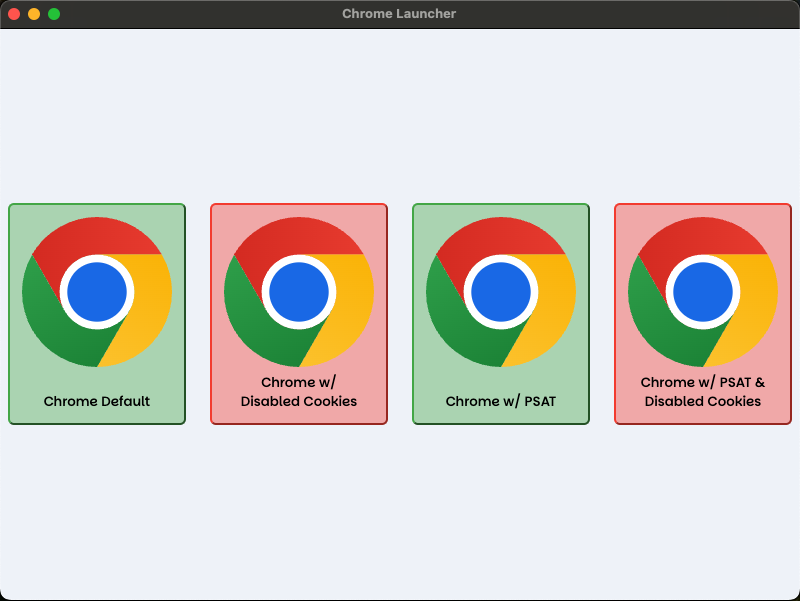

## Chrome Launcher App

> This app allows launching a number of Chrome instances simultaneously. Each instance can be launched with various options like Third-party cookies enabled/disabled or with the [PSAT extension](https://github.com/GoogleChromeLabs/ps-analysis-tool/wiki) installed.



## Download

<div>
  
  <a href="https://github.com/charisTheo/chrome-launcher/releases/latest">Download the latest version for your chip architecture (ARM or Intel x64)</a>
</div>

----

## Contribute

### Install & run locally

```sh
npm i && npm start
```

### Develop locally

```sh
npm run dev
```

> This command launches the app and registers a file watcher that will reload the app on each change saved.

## Release

New releases will only be executed by Github Actions after pushing a commit and a tag on the `main` branch:

Example:
```sh
git checkout main
git merge develop
npm version minor
git push --follow-tags
```
